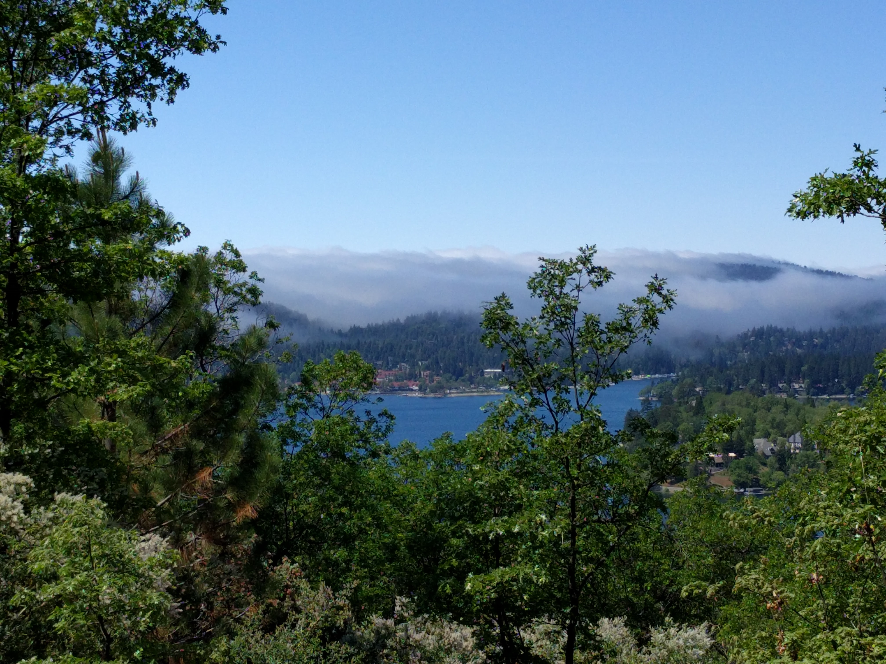

# Pasadena Astronomy Postdoc Retreat (PAPR) 2019

## Pre-retreat hike

Similar to the past two years, we are considering an optional pre-retreat hike in the morning before the retreat. The [Sawmill Road Loop Trail](https://www.alltrails.com/explore/trail/us/california/sawmill-road-loop-trail) is only 3 miles long, features wonderful views, and is just a 5-minute drive from the conference center. 

# What is PAPR?

The purpose of this annual informal meeting is to bring together postdocs from the various astrononomy institutes in Pasadena (Carnegie, Caltech Astro/GPS, IPAC, JPL, UCLA, and UCR), and to get to know each other's science. Building on previous years' experience, the retreat is an opportunity to cross institutional boundaries, foster new collaborations, and enrich the experience of being an astronomy postdoc in the City of Astronomy.

This year's retreat will be held on May 1st-3rd 2019. The program included a mix of brief research talks by attendees, 3-4 career development talks by our invited speakers, and several social gatherings. 

# 2019 Organizing Committee

- Louis Abramson (Carnegie)
- Virginie Faramaz (JPL/Caltech)
- Sebastian Kiehlmann (Caltech)
- Abhishek Prakash (IPAC/Caltech)

# Registration

The registration fee is $560 per person.
Carnegie funded 100% of the cost of the retreat for its postdocs. 
Caltech astronomy funded 50% of the cost of the retreat for its postdocs. The rest of the funding have to come from the postdoc's travel funds.
For the other institutions, there was unfortunately no funding available for this year's retreat, and thus 100% had to come from the personal travel fund.

# The Venue

## Transportation / carpools

The retreat is held at the  [UCLA Lake Arrowhead Conference Center](http://lakearrowheadconferencecenter.ucla.edu/about/directions/), which is a convenient [2 hour](https://www.google.com/maps/dir/Pasadena,+California/UCLA+Lake+Arrowhead+Conference+Center,+850+Willow+Creek+Rd,+Lake+Arrowhead,+CA+92352/@34.1971218,-117.9448351,10z/data=!3m1!4b1!4m18!4m17!1m5!1m1!1s0x80c2c2dc38330b51:0x52b41161ad18f4a!2m2!1d-118.1445155!2d34.1477849!1m5!1m1!1s0x80c357e80a92254b:0xdc8a5a45759372b0!2m2!1d-117.1866611!2d34.2655173!2m3!6e0!7e2!8j1525865100!3e0) drive from Pasadena. 

Like previous years, we will organize a carpooling system to help everybody go to the venue.
[Carpooling Spreadsheet here.](https://docs.google.com/spreadsheets/d/1d5grzYo76jLK4t76VM5wbl9XyPsMx03dwn5YkGQGnqk/edit?usp=drive_web&ouid=106650781263756717976)

## Activities
The Conference Center has plenty of outdoor activities: 
Swimming pool, Hot tub, Tenis Court, Sand Volleyball Court, Zen deck, Climbing wall...
Don't forget to bring your sportwear if you want to enjoy these activities!

## Accommodations and meals

The UCLA conference center fully [accommodates](http://lakearrowheadconferencecenter.ucla.edu/stay-at-ucla-lake-arrowhead-conference-center/) and [caters](http://lakearrowheadconferencecenter.ucla.edu/dining/) for us. The 'condolets' at the conference center accommodate two people, and offer a queen size bed with bath downstairs and a second queen size bed with bath upstairs. A living room area with wood-burning fireplace is shared by two conferees. All condolets have large decks with potential lake or forest views.

Attendees share their room with another attendee. 
Please this [Spreadsheet](https://docs.google.com/spreadsheets/d/1d5grzYo76jLK4t76VM5wbl9XyPsMx03dwn5YkGQGnqk/edit?usp=drive_web&ouid=106650781263756717976) to organize roommate preferences.
Otherwise roommates are assigned on a same-gender basis.

The conference center caters for all meals, which are covered in the cost of the retreat. They accommodate all dietary requirements detailed during registration. Dietary restrictions are listed [here](https://docs.google.com/spreadsheets/d/1d5grzYo76jLK4t76VM5wbl9XyPsMx03dwn5YkGQGnqk/edit?usp=sharing).
